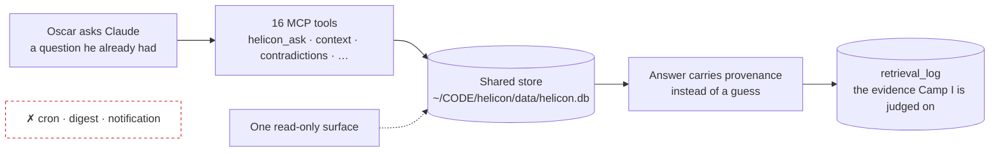

# Mountain of Helicon — Roadmap

**Three gates, in order. Two camps and a summit.** Nothing below is a feature list.
Each camp is a claim about the world that is either true or false on a given day,
and each one names the judge who decides — a judge that is neither Claude nor
Helicon itself.

Numbers below carry their probe. Where a claim was not probed it says `unverified`
and does not get smoothed over. This file was written 2026-08-10 against
`origin/main` at `b853000`.

## The governing ruling

> "it's easier for me to just ask you."

That is the whole product constraint, in Oscar's words. Helicon does not compete
to be an app, because the app it would have to beat is a conversation. It is the
**truth layer behind the asking** — the 16 MCP tools (`CLAUDE.md:28`) an agent
already reaches for mid-answer — plus **one** read-only surface for the cases a
tool call cannot render.

**Pull, never push.** No cron that files a report. No digest. No notification.
If Helicon has to interrupt Oscar to be used, it has already lost to the thing it
is trying to help.



---

## Camp I — Oscar uses it daily

**The claim:** Helicon answers questions Oscar actually asked, on 30 consecutive days.

**Done when:** 30 consecutive days each show at least one retrieval that served a
question Oscar asked, judged from `retrieval_log` in the live store — not from his
memory of having used it.

**Judge:** Oscar, reading a 30-row printout he did not curate and cannot edit
after the fact. Not Claude. Not the tool's own summary of itself.

**Why the log and not his memory:** he has repeatedly believed he used a tool he
had not opened in a week. The store is the only witness that does not flatter.

**What has to be true first:** the Needs Ruling queue must stop handing agent work
to a human. See *Camp I, slice 1* below — it is the only thing between here and
daily use.

### Camp I, slice 1 — auto-resolve what a probe can settle

Today **every** rulable finding reaches Oscar. His own review doctrine
(vault `00 Dashboard/multi-model-review-loop.md`) says machines auto-rule the
high-confidence cases and only near-ties reach him. The queue violates the
doctrine it was built from.

Probe, run 2026-08-10 from `~/CODE/helicon`:

```
$ helicon resolve --list
Open findings: 394
  R1 cross-source contradiction            8
  R11 identity coherence                   3
  R3 staleness / expiry                  254
  nightly                                 15
  output                                  94
  routine                                 20
```

**Correction to carry forward:** the working number is not "8 open findings".
It is **394 open**, of which 11 are rulable today (8 R1 + 3 R11). The other 383
are filed but the resolve verb does not apply to them. A roadmap that plans
against 8 is planning against the wrong denominator.

The rulable 11:

| # | Class | Conflict | Settled by |
|---|---|---|---|
| 413 | merge-status | `commits/main/origin` merged(2) vs unmerged(1) | probe |
| 414 | canon drift | episode `ep29/revival` — canon says 29 | probe (read canon) |
| 415 | canon drift | episode `podcast` — canon says 29 | probe (read canon) |
| 417 | decision-status | `decisions/rules` executed(1) vs open(2) | probe or Oscar |
| 421 | merge-status | `main/verified` merged(5) vs unmerged(2) | probe |
| 422 | merge-status | `prod/pushed` merged(1) vs unmerged(3) | probe |
| 424 | decision-status | `decision/oscar` executed(1) vs open(3) | Oscar |
| 425 | canon drift | episode `ep30` — canon says 29 | probe (read canon) |
| 432 | identity fork | `'api'` door vs test | probe |
| 433 | identity fork | `'kya'` listed vs aud | probe |
| 451 | identity fork | `'nullspace'` submission vs wrapper | **Oscar — a naming call** |

**The rule that makes this safe:** never auto-resolve by counting claims. A
majority of five wrong sources is still wrong. Resolve by evidence
(`git rev-list`, `git branch --merged`, `curl`, reading the canon file), and
record the probe output as the receipt on the finding.

**Slice 1 done when:** `helicon resolve --list` shows at most 2 rulable findings
open, each genuinely human-only, each carrying a one-line statement of what Oscar
must decide and why no probe can settle it. Every auto-resolved finding carries
its probe output.

**The store, located:** both repos read the same database.
`config.json:2` here reads `"db_path": "/Users/morkeeth/CODE/helicon/data/helicon.db"`.
The findings live in the `audit_log` table, selected by `human_decision IS NULL`
(`~/CODE/helicon/helicon/cli.py:1599`, `cmd_resolve`). There is no `findings`
table; a plan that greps for one will find nothing and conclude wrongly.

### Kill criterion — Camp I

> **Under 10 days of use in the first 30 kills the daily-use thesis.**

Not "extend the window". Not "improve onboarding". The thesis dies and the camp
is struck.

---

## Camp II — a stranger finds something Oscar cannot explain away

**The claim:** one person who is not Oscar installs Helicon, runs it on their own
repository, and reports one finding Oscar did not write and cannot dismiss.

**Done when:** that finding exists in writing — an issue, a message, a post —
from a named person who is not Oscar, about a repository Oscar does not own.

**Judge:** the stranger. They are the judge precisely because they cannot be
coached, and because "a Helicon user who is not Oscar" is the one piece of
evidence the whole project is missing (see `project_open_source_contributions.md`).

**Why this camp is second and not first:** a stranger who installs a tool Oscar
does not open himself is being handed a liability.

### R1b — same-source contradiction (not folded into R1)

R1 compares claims **across** sources, by design: `pairing.py:408` skips a pair
with `one file arguing with itself is not cross-source`. So two lines inside one
`CLAUDE.md` that say "always use v1" and "always use v2" report **CLEAN**.

Filed as its own item rather than as an R1 gap, because it is the first thing a
first-time tester plants. Verified 2026-08-14 on a scratch repo against the
published 0.1.0 wheel: planted, and R1 returned CLEAN. That is correct behaviour
for R1 and a wrong answer to the user's question. Until it exists, outreach copy
says "a rule in one file fights a rule in another source", never "contradict each
other" unqualified.

### The port that Camp II depends on

The work-graph control plane exists in `~/CODE/helicon` and **not** in this
repository. Probe, 2026-08-10:

```
$ git -C ~/CODE/helicon log -1 --oneline 0639b53
0639b53 build: add agentic work graph control plane

$ git -C ~/CODE/helicon show --stat --oneline 0639b53 | tail -1
 63 files changed, 2436 insertions(+), 57 deletions(-)

$ git -C ~/CODE/mountain-of-helicon log -1 --oneline 0639b53
fatal: ambiguous argument '0639b53': unknown revision or path not in the working tree.

$ git ls-tree -r --name-only origin/main | grep -iE 'workgraph|work_graph|wager'
(no output)
```

**Correction to carry forward:** the commit is **2,436 insertions across 63
files**, not ~1,900 lines. It is measured, not estimated.

This is a **port, not a cherry-pick.** The two trees diverged; the commit touches
63 files including `web/src/components/WorkgraphView.tsx` and `Focus.tsx`, which
do not have the same shape here. Anyone who reaches for `git cherry-pick 0639b53`
will get a conflict storm and should stop.

`unverified`: how much of the 2,436 lines Camp II actually needs. It is possible
the stranger path needs none of it. Probe before porting.

### Kill criterion — Camp II

> **A first stranger who finds nothing Oscar could not have told them stops the port.**

The port is downstream of the stranger, not upstream. Build it after the finding
exists, not in anticipation of one.

---

## Summit — launch

**Gated on both camps being true.** Not one. Not "Camp I plus momentum".

**Done when:** Camp I's 30-day printout and Camp II's stranger finding both exist,
and the launch goes out.

**Judge:** the first public reader who is not Oscar and not a friend — the author
of the first GitHub issue, or the first reply from someone who found it on their
own. A launch nobody outside the room reacts to has not happened.

**`unverified`:** launch surface (repo public? post? where?). Not decided, and
deliberately not decided here — deciding it now would be building the summit
before the camps.

---

## Kill criteria, verbatim and in one place

These are quoted, not paraphrased. They are the parts of this roadmap that are
allowed to end work.

1. **Under 10 days of use in the first 30 kills the daily-use thesis.**
2. **A first stranger who finds nothing Oscar could not have told them stops the port.**
3. **A queue that still feels like doing the tool's job after auto-resolve gets deleted, not redesigned.**

Criterion 3 is the one most likely to be argued with. It is not an invitation to
a fourth redesign of the queue.

---

## Verified state, 2026-08-10

Every row was re-probed for this file. Two carried facts were **wrong** and are
corrected here rather than repeated.

| Fact | Probe | Result |
|---|---|---|
| `b853000` doorway cwd-shadowing fix is on `origin/main` | `git branch -r --contains b853000` | ✅ `origin/main`; it is also HEAD |
| `run_cards` is wired, not schema-only | `grep -n "def persist_run_card" helicon/runs.py` | ✅ line **271**; called from `cli.py:627` and `runs.py:330` |
| live DB holds 23 `run_cards` rows | `sqlite3 ~/CODE/helicon/data/helicon.db "select count(*) from run_cards;"` | ✅ **23**. Note: 4 other `.db` files under `~/CODE/helicon/data/` hold 0 or 3. `config.json:2` names which one is live |
| `0639b53` exists only in `~/CODE/helicon` | `git log -1 --oneline 0639b53` in both trees | ✅ absent here — **and it is 2,436 lines, not ~1,900** |
| `cursor/intervention-gate-on-main-8e52` is a ghost | `git cherry origin/main <branch>` | ⚠️ **not literally.** Returns `+ ba45eb6` — patch-id absent from main. But `outcome_contract.py` is byte-identical to main's, and main's `intervention.py` is a **superset** (branch is 50 lines smaller). Functionally superseded, safe to delete; the one-line "main holds it as a superset" was too strong |
| `doorway/install-resolved` is a ghost | `git cherry origin/main <branch>` | ✅ empty output — its patch is already in main. True ghost |

Reproduce the whole table:

```bash
cd ~/CODE/mountain-of-helicon
git branch -r --contains b853000
git cherry origin/main origin/cursor/intervention-gate-on-main-8e52
git cherry origin/main origin/doorway/install-resolved
git log -1 --oneline 0639b53                      # expect: fatal, unknown revision
grep -n "def persist_run_card" ~/CODE/helicon/helicon/runs.py
sqlite3 ~/CODE/helicon/data/helicon.db "select count(*) from run_cards;"
```

## What this roadmap does not contain

No dates. No effort estimates. No feature backlog. A camp is reached or it is not,
and the only thing that moves the project forward is a judge who is not in the
building.
